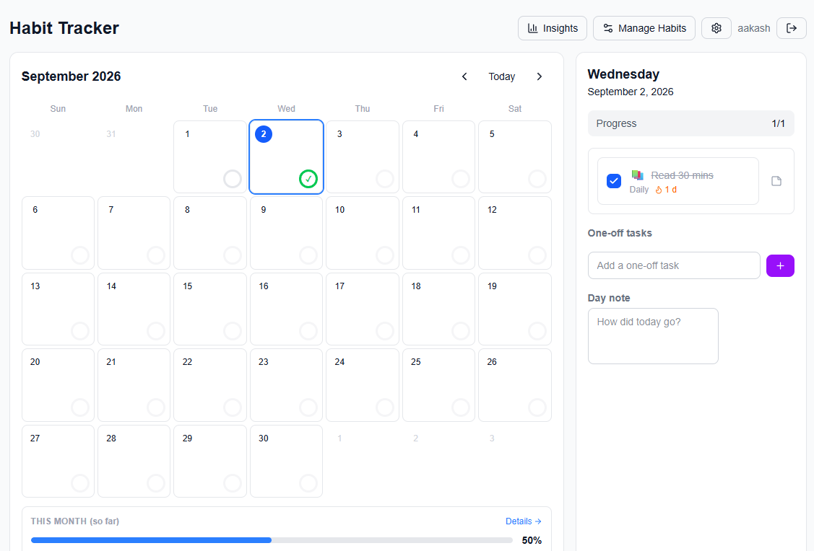

# Habit Tracker

A full-stack habit tracking app with a monthly calendar, recurring habits, streaks, notes, one-off tasks, insights, and dark mode. Ships two ways: as a deployable web app, or as a self-contained Windows installer.




## Tech Stack

**Frontend**
- Next.js (App Router) + TypeScript
- Tailwind CSS
- TanStack Query — server state, caching, optimistic updates
- Zustand — UI state + persisted settings
- date-fns, lucide-react

**Backend**
- Spring Boot 3 (Java 21), Maven
- Spring Data JPA + Spring Security
- JWT auth (jjwt), BCrypt password hashing
- MySQL (default) or embedded H2
- Swagger / springdoc-openapi

## Features

**Tracking**
- Monthly calendar grid with per-day progress rings
- Per-habit scheduling — daily, weekdays, specific days, or X times per week
- Habit management — create, edit, archive (history preserved), reorder
- Categories with colour tags
- One-off tasks tied to a single date
- Notes — one per day, plus one per task per day
- Editable habit start dates (backdate or schedule ahead)

**Insights**
- Summary cards — active habits, average completion, best streaks
- 12-week activity heatmap
- Per-habit completion rates
- Streak tracking — day-based, or week-based for "X times per week" habits
- Month-over-month trend with best-month highlighting
- Month deep dive — per-habit breakdown, best/toughest day, vs-previous-month delta
- Perfect-day streaks (all-time and per-month)

**Accounts & preferences**
- JWT authentication with invite-code-gated registration
- Full per-user data isolation
- Dark mode
- Configurable week start (Sunday/Monday), persisted locally

## Architecture Notes

- **Server state** lives in TanStack Query; **UI state** (selected date, current month, settings) in Zustand. Clean separation, no duplication.
- **Date-ranged data** (completions, notes, one-offs) is fetched per visible month and cached per range.
- **Optimistic updates** on high-frequency actions (completion and one-off toggles) with rollback on failure.
- **Streaks are computed server-side** so they reflect full history rather than the loaded month.
- **Archiving instead of deleting** habits keeps completion history intact.
- Habit `frequency` is stored as a JSON column, matching the frontend's discriminated union 1:1.

## Prerequisites

| Goal | Requirements |
|---|---|
| **Run the Windows installer** | Windows 10/11 + a browser. Nothing else — JRE and database are bundled. |
| **Run the JAR directly** | JDK/JRE 21 |
| **Develop from source** | JDK 21, Node.js 18+ (20 LTS recommended), MySQL 8 *(optional)* |
| **Build the Windows installer** | Above + WiX Toolset **v3.14** (v4/v5 are not jpackage-compatible) |

Maven isn't needed — the `mvnw` wrapper handles it. Ports used: **8080** (backend), **3000** (frontend dev server).

## Getting Started

Two config files are gitignored and must be created locally.

### 1. Backend

Database options:

**MySQL**

```sql
CREATE DATABASE habit_tracker;
```

Then create `backend/config/application.properties`:

```properties
spring.datasource.url=jdbc:mysql://localhost:3306/habit_tracker
spring.datasource.username=root
spring.datasource.password=YOUR_PASSWORD
spring.datasource.driver-class-name=com.mysql.cj.jdbc.Driver
```

**H2** *(`offline-build` branch default)* — no setup. Data is written to `~/.habit-tracker/habit_tracker.mv.db`.

Then:

```bash
cd backend
./mvnw spring-boot:run
```

API on `http://localhost:8080` · Swagger at `/swagger-ui.html`

### 2. Frontend

Create `frontend/.env.local`:

```
NEXT_PUBLIC_API_BASE_URL=http://localhost:8080/api
```

> On the `offline-build` branch use `/api` instead — the frontend is served same-origin from Spring Boot.

Then:

```bash
cd frontend
npm install
npm run dev
```

App on `http://localhost:3000`

### 3. Register

Use the invite code from `app.registration-code` in `application.properties` (default: `dev-invite`).

## Configuration

All backend settings are environment-overridable:

| Variable | Purpose | Default |
|---|---|---|
| `DB_URL` / `DB_USERNAME` / `DB_PASSWORD` | Database connection | H2 file mode |
| `JWT_SECRET` | Token signing key — **must be 32+ chars** | dev placeholder |
| `REGISTRATION_CODE` | Invite code for sign-up | `letmein` |
| `CORS_ORIGINS` | Comma-separated allowed origins | `http://localhost:3000` |
| `PORT` | Server port | `8080` |

> Always set a real `JWT_SECRET` and `REGISTRATION_CODE` before deploying or distributing.

## API Overview

| Method | Endpoint | Description |
|---|---|---|
| `POST` | `/api/auth/register` | Register (requires invite code) |
| `POST` | `/api/auth/login` | Log in, returns JWT |
| `GET` | `/api/auth/me` | Current user |
| `GET` `POST` `PUT` `DELETE` | `/api/categories` | Category CRUD |
| `GET` `POST` `PUT` | `/api/habits` | Habit CRUD |
| `PATCH` | `/api/habits/{id}/archive` | Archive a habit |
| `PATCH` | `/api/habits/{id}/reorder` | Move up/down |
| `GET` | `/api/habits/{id}/streak` | Current + longest streak |
| `GET` `PUT` | `/api/completions` | Fetch range / upsert completion |
| `GET` `PUT` | `/api/day-notes` | Fetch range / upsert day note |
| `GET` `POST` `PATCH` `DELETE` | `/api/one-offs` | One-off task CRUD |

All `/api/**` routes except register and login require `Authorization: Bearer <token>`.

## Branches

| Branch | Purpose |
|---|---|
| `main` | Cloud-deployable — MySQL, separate frontend/backend hosting |
| `offline-build` | Self-contained Windows app — H2 file DB, static frontend embedded in the JAR, packaged with jpackage |

## Building the Windows Installer

*(`offline-build` branch)*

```bash
build-installer.bat
```

Pipeline: static-export the frontend → embed into Spring Boot's `static/` → package the fat JAR → `jlink` a trimmed ~55 MB runtime → `jpackage` a Windows `.exe`. Output lands in `backend/target/installer/` at roughly 110–140 MB.

The installed app launches a local server and opens the browser automatically.

**Known limitations:** runs headless (no window — stop it via Task Manager), requires port 8080 free, and shows a Windows SmartScreen warning since the installer is unsigned.

## Deploying

*(`main` branch)*

Frontend to Vercel (root directory `frontend`), backend to any JVM host with a managed database (root directory `backend`). Set `NEXT_PUBLIC_API_BASE_URL` on the frontend and the DB/JWT/CORS variables on the backend, then point `CORS_ORIGINS` at the deployed frontend URL.